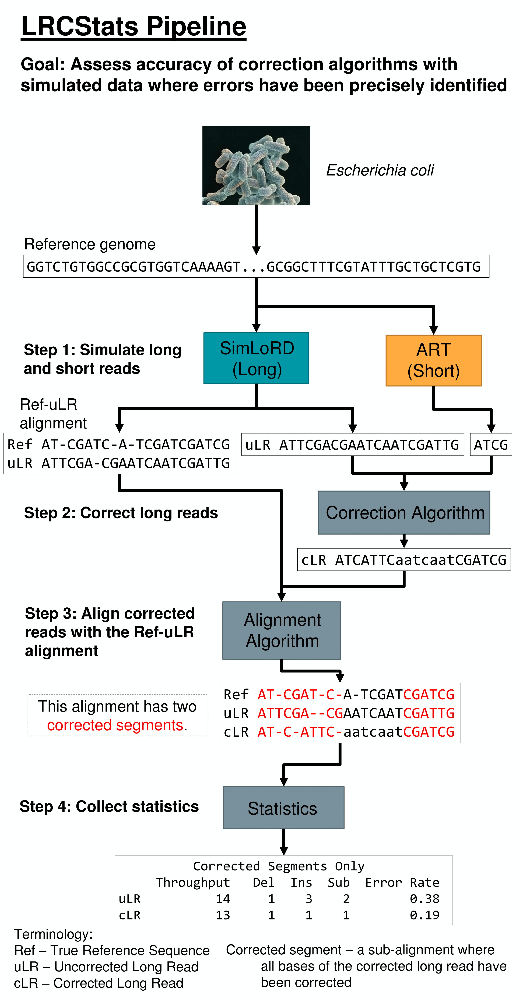

# LRCstats: Long Read Correction Statistics #
LRCstats is an open-source pipeline for benchmarking DNA long read correction algorithms for long reads outputted by third generation sequencing technology such as machines produced by Pacific Biosciences. The reads produced by third generation sequencing technology, as the name suggests, are longer in length than reads produced by next generation sequencing technologies, such as those produced by Illumina. However, long reads are plagued by high error rates, which can cause issues in downstream analysis. Long read correction algorithms reduce the error rate of long reads either through self-correcting methods or using accurate, short reads outputted by next generation sequencing technologies to correct long reads.

Of course, some long read correction algorithms are better than others, and developers of long read correction algorithms will wish to compare their algorithm with others currently available. LRCstats benchmarks long read correction algorithms using long reads produced by simulators (such as SimLoRD or PBSim) where the two-alignment between the uncorrected long reads (uLR) and the corresponding sequences in the reference genome (ref) is given in a Multiple Alignment Format (MAF) file, and then aligning the corrected long reads (cLR) to the ref-uLR two-way alignments to create three-way alignments using a dynamic programming algorithm. Statistics on these three-way alignments are then collected, such as the overall error rates of the corrected long reads.



## Dependencies ##
* Python 2.7.2
* Any version of g++ with c++11 support

## Installation ##
Clone this repository with the command 
```
git clone --recursive https://github.com/thefantasticdron/lrcstats.git
```

Compile the aligner with the command:
```
./install.sh
```

The rest of the pipeline is written in Python so you just need to make sure your version of Python run by the command `python` is 2.7.2.

## Usage ##
1. Create your own configuration file with `python lrcstats.py --blank_config CONFIG_PATH`. The configuration file will be created at the path specified by `CONFIG_PATH`.
2. Modify the configuration file to contain the paths to the cLR FASTA and ref-uLR MAF files along with the directory on your system at which you would like to store the temporary and result files.
3. Construct the LRCstats script with the command `python lrcstats.py CONFIG_FILE OUTPUT_PATH` where `CONFIG_FILE` is the path to your configuration file and `OUTPUT_PATH` is the path at which the LRCstats script will be created.
4. Execute the LRCstats benchmarking pipeline by either running it as a bash shell script or submitting it as a job to your TORQUE/MOAB compatible computing cluster.

## Input ##
The main two files that LRCstats takes as input are:

1. a corrected long reads file in FASTA format
2. a ref-uLR two-way alignment file in MAF format

The paths to these files can be provided in either a configuration file or as command line arguments.

If the corrected long reads file is given as a FASTQ file instead, the LRCstats repo includes a python script `src/preprocessing/fastq2fasta.py` to convert FASTQ files into FASTA format. Likewise, SimLoRD outputs the alignment between the uncorrected long reads and the reference sequence in SAM format. The python script `src/preprocessing/sam2maf.py` converts SAM files into the MAF format.

## Configuration File ##
LRCstats takes as input a configuration file specifying

1. The details of the experiment
2. Paths to files and directories on the user's machine
3. Commands to be initialized prior to the start of the pipeline (optional)
4. PBS parameters to include in the header of the script outputted by LRCstats (optional)

Details of the experiment (1) and paths on the user's machine (2) can also be provided as command line arguments. However, initialization commands (3) and PBS parameters (4), if the user wishes to include them in the script, must be provided in a configuration file.

### Experiment Details ###

* Name of experiment
* Number of threads to be provided to the dynamic programming alignment program
* Whether the corrected long reads are trimmed
* Whether the corrected long reads are extended

### Paths ###

* `data` the directory where the user wishes to store the files created by the LRCstats pipeline, such as temporary files and the result file
* `clr` the path to the corrected long read FASTA file
* `maf` the path to the ref-uLR two-way alignment MAF file

### Initialization Commands (Optional) ###

Commands specified here could be those that load the dependencies onto the user's environment, such as
* `module load python2.7`
* `module load g++/5.1.0`

### PBS Parameters (Optional) ###

The user may specify the PBS parameters that will appear in the header of the script if the user wishes to run the pipeline as a PBS job. Parameters may include the walltime limit, memory limit and the number of processors allocated to the job. Note that the number of cores specified in the PBS parameter list should be identical to the number of threads specified under the "Experiment Details" section.

## Output ##

`lrcstats.py` outputs a script that can be run as either a bash script or submitted to a Moab/TORQUE compatible computing cluster. This script performs the following steps:

1. Sorts the cLR FASTA file and removes Ref-uLR alignments in the MAF file that do not appear in the cLR FASTA file
2. Constructs the three-way alignments between the corrected long reads, uncorrected long reads and the reference sequences
3. Produces statistics on the three-way alignments

If `data` is the user-specified output directory and `experiment-name` is the name of the experiment, the correction statistics can be found at `data/experiment-name_results.txt`.

## Directory Structure ##

* `notebooks` contains notebooks describing experiments featured in the LRCstats paper and other past experiments.
* `scripts` contains example scripts for the simulation of short and long reads and the correction of long reads.
* `src` contains source code and Python scripts for LRCstats pipeline. Users may find scripts in here useful.
* `tests` contains scripts for unit and integration tests of LRCstats.
